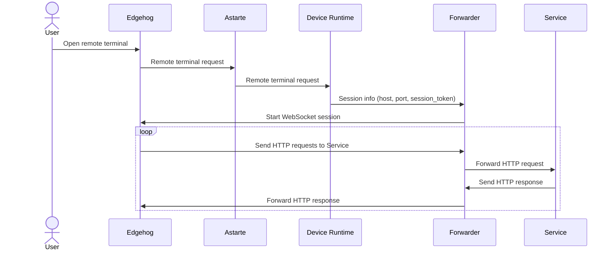

<!---
  Copyright 2024 SECO Mind Srl
  SPDX-License-Identifier: Apache-2.0
-->

# Edgehog Device Runtime Forwarder Library

## Overview

The Edgehog Device Runtime Forwarder Library facilitates the communication and interaction
between devices and Edgehog through WebSocket connections. This README provides a guide to
understanding the structure of the library and how its components work together.

## Sequence Diagram

The end user triggers a remote terminal request on the Edgehog Device Manager interface. Edgehog is responsible for
sending the request to Astarte, which then forwards it to the Device Runtime, handling device operations.
The Device Runtime retrieves session information from the remote terminal request and communicates it to the Forwarder,
a module capable of managing connections with the device.
Using the received information, the Forwarder establishes a WebSocket connection with Edgehog. On top of this
connection, other types of connections (HTTP, WebSocket, etc.) can be established. At this point of the implementation,
the library only supports HTTP connections. For instance, the Service receiving HTTP requests could be an HTTP server
providing access to some device resources. In this scenario, Edgehog makes one or more HTTP requests to the Forwarder,
which forwards them to the Service. Then the Service replies with one or more HTTP responses, that will be forwarded
to Edgehog.

## Components

### Connections Manager

- Establishes a WebSocket connection between the device and Edgehog.
- Acts as a multiplexer for forwarding messages between Edgehog and internal device connections (e.g., with
[ttyd](https://github.com/tsl0922/ttyd)).
- Handles WebSocket frames (carrying HTTP requests/responses), decoding binary data into an internal Rust representation.
- Handles reconnection operations on WebSocket errors.
- Maintains a collection of connections with channel writing handles.

### Collection

- Maintains a map of connections, each identified by a Host, a port and a session token.
- Defines methods to add and remove new device connections.
- Allows disconnecting from all connections.

### Connection

- Defines `Connection` and `ConnectionHandle` structs.
- Creates a new connection.
- Spawns Tokio tasks responsible for managing connections.
- Sends HTTP requests (e.g., to ttyd) and encodes responses into protobuf messages.

### Messages

- Defines an internal representation of the possible messages travelling on the WebSocket connection with Edgehog.
- Implement utility methods and traits to perform simple type conversions.

### Astarte

- Provides the necessary functions to convert an `Astarte aggregate object` into a `SessionInfo` struct, used by the
library to store the session information between the device and Edgehog.

## Usage

The entry point to the library's functionalities is the `ConnectionsManager` struct, which exposes two main methods:

- **`connect`**: This method takes as input the URL containing the information necessary to establish a
WebSocket session with Edgehog.
- **`handle_connections`**: This method continuously loops, managing send/receive events over the WebSocket channel.

The `astarte.rs` module contains the functionalities that can be utilized to retrieve
the URL from the session information sent by Astarte.
